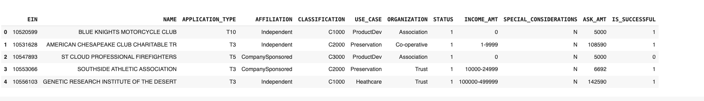

# deep-learning-challenge 

### Purpose 
This module challenge was to create a neutral model for prediciting the success of different organizations that were funded by Alphabet Soup. It will find out which patterns showed a successful organization  
### Results 
#### Preprocessing the data
- Target Varible: 
    - IS_SUCCESSFUL is the target variable. It indicates whether the funding was used effectively. 
- Feature Variable: 
    - The features of the model are the application types, affiliations, use cases,income amounts, income amounts organization types, and classifications  
- Removing variables 
    - The variables, EIN, and NAME columns are removed since they do not contribute to the model predictive power 
#### Compiling, Training and Evaluating the Model
-  Neurons and Layers: 
    - For the first hidden layer, I chose 80 neurons and for the second hidden layer, I chose 30. 
- Activation Functions: 
    - The Relu acivitation was used for the hidden layders and sigmoid activation function was used in the binary classification part of the model. 
-  Training of model
    - this model started with using one epochs because I found using more then that did not improve performance. 
Increasing model performance 
    - increasing the number of neurons 
    - adding more hidden layers 
    - increasing the amount of epochs 
    - dropping more features during analysis 
### Optimizing the model 
The goal of this was to surpass the 75% accuracy. 
#### Approaches to increasing model optimization 
1. Increasing the number of neurons 
    - I increased the number of neurons to 120 in first layer and 80 in the second. I wanted to see if more neurons increased the model ability to find patterns. 
2. Adding one more hidden layer 
    - One more hidden layer was added to see if it could find a better relationship. 
3. Changing the activation function 
    - The model dropped the relu function and used tanh function. I wanted to see if a different activation function impacted model performance 
4. Running with more epochs 
    - I increased the number of epochs to 2 to see if model performance increased 
5. Dropping more features 
    - I dropped more features to see if it reduced the amount of noise in the model and got more performance and accuracy. 
6. Using the Keras Tuner for Hyperparameter tuning 
    - The model used the Keras Tuner function to see if it was better at finding better hyperparameters in the neural network. 
#### Result of optimization strategies 
1. More neurons: 
    - Loss: 0.5590114593505859, Accuracy: 0.7232652902603149
2. Layers: 
    - Loss: 0.5551750063896179, Accuracy: 0.7230320572853088
3. Different activation: 
    - Loss: 0.5583950877189636, Accuracy: 0.7237317562103271
4. More epochs: 
    - Loss: 0.5544808506965637, Accuracy: 0.7262973785400391
5. Dropping features: 
    - Loss: 0.5620999932289124, Accuracy: 0.7238484025001526
6. Keras Tuner: 
    - Loss: 0.5554741024971008, Accuracy: 0.7238484025001526
### Conculusion of optimization strategies
In conclusion, I found that getting above 75% was very hard to get. None of the different strategies significantly did better then the original model. In order to pass 75% accuracy, more model optimization and a better neural network is probably required. 
### Summary of model 
The original and optimized neural networks accuracy is around 72.5%. Despite attempting new methods at increasing the accuracy of the model, getting to the 75% was not possible. This suggests that the problem lies with the original data and how complex the problem was compared to the model. 
### Alternatives approaches 
The Random Forest Classifer is one method that would be intresting to try out in the future. This is because this classifer is better able to do things such as handeling different data types and has good flexibility to handle large datasets. 
### References 
For this project, I used the examples from class to help me and used the module instructions. I also consulted the TensorFlow and Keras documention when I was having problems with that section. 

